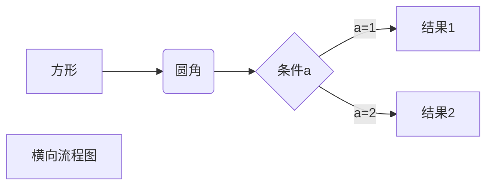

* content
{:toc}
在windows下发现一个很棒的markdown编辑器，尝试了一些基础功能，还发现了一些hexo渲染的问题，特记录一下。 <!--more-->

### 插入图片

#### 插入本地图片

插入的图片资源都要放在\source\images目录下面，本地的图片直接上传的话，大小要自己调整，格式``

{:refdef: style="text-align: center"}

{:refdef}

针对 HEXO 博客来说可以使用 `img` 标签实现缩放

``

#### 插入在线图片

格式``

<div  align="center">

</div>

#### 那么怎么调整图片大小呢？

可以考虑设置主题整体缩放50%，或者将图片转换成在线图片之后修改img的属性

### 插入代码 输入3个`和一个空格

这个是行间代码输入`print`

```python
def guassian_kernel(source, target):
    n_samples = int(source.size()[0])+int(target.size()[0])
    total = torch.cat([source, target], dim=0)
```


### 输入‘| ’3个按回车即可实时插入表格（或者按Ctrl+T）

|  1   |  2   |  3   |  3   |
| :--: | :--: | :--: | :--: |
|  1   |  2   |  3   |  7   |


### 插入网址：Ctrl+K

[Trends of transfer learning](https://github.com/chamwen/Transfer-learning-trends)


### 插入引用

> balabala
>
> > 输入>和一个空格，进入引用模式
> >
> > >  按两次回车退出引用

### 插入流程图

和插入代码原理一样，不过得选择语言；类型有mermaid、flow，首先安装插件

```
npm install --save hexo-filter-mermaid-diagrams
npm install --save hexo-filter-flowchart
npm install --save hexo-filter-sequence
```
这里具体还有一些操作参考 [HEXO支持流程图](https://www.liuyude.com/How_to_make_your_HEXO_blog_support_handwriting_flowchart.html)，需要注意的是 mermaid 安装时如果用 npm 的话要加 `--save`

#### 普通流程图mermaid



#### 标准流程图

```flow
st=>start: 开始框
op=>operation: 处理框
cond=>condition: 判断框(是或否?)
sub=>subroutine: 子流程
io=>inputoutput: 输入输出框
e=>end: 结束框
st->op->cond
cond(yes)->io->e
cond(no)->sub(right)->op
```


### 输入数学公式

1. **首先，在NexT 主题的 `_config.yml` 文件里设置，**
```
math:  
  enable: true
```

2. **不需要替换markdown的渲染引擎**，直接修改\node_modules\marked\lib下面的marked.js文件，实测所谓的hexo-renderer-kramed新框架虽然公式正常，但是**不能加粗
```
//escape: /^\\([\\`*{}\[\]()#+\-.!_>])/,
escape: /^\\([`*\[\]()#$+\-.!_>])/,
//strong: /^__([\s\S]+?)__(?!_)|^\*\*([\s\S]+?)\*\*(?!\*)/,
strong: /^\*\*([\s\S]+?)\*\*(?!\*)/,
//em: /^_([^\s_](?:[^_]|__)+?[^\s_])_\b|^\*((?:\*\*|[^*])+?)\*(?!\*)/,
em: /^\*((?:\*\*|[^*])+?)\*(?!\*)/,
```

3. **实际操作**，Ctrl+M，插入单独一行的公式；关于输入行内公式，直接两个$，或者按快捷键Alt+X

